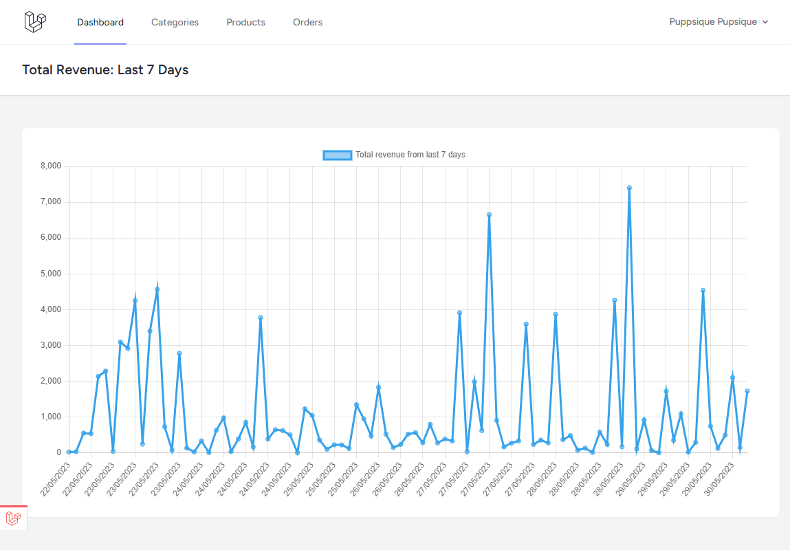
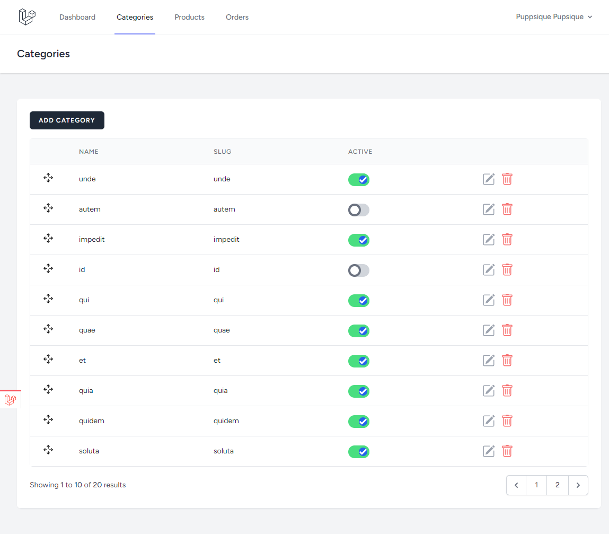
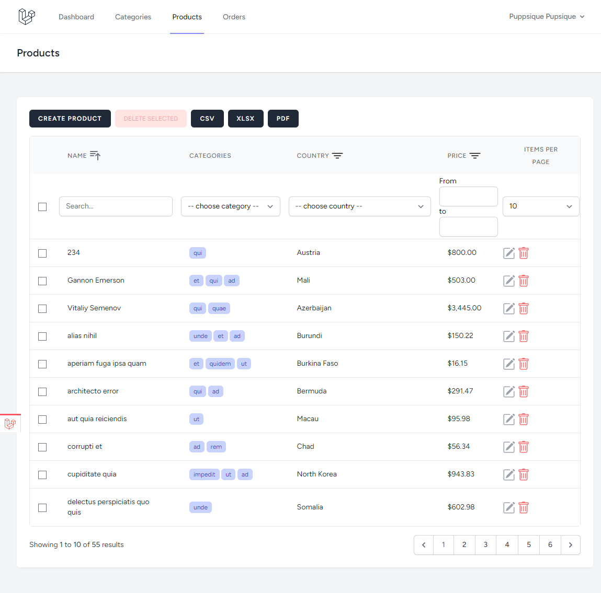

# Laravel Livewire Order Management System

It was created a project to manage orders/products/categories with Laravel and add a lot of dynamic features with Laravel Livewire.

Here are a few screenshots from the application:

## Run The Project

    git clone git@github.com:deepydee/order-management-system.git
    cd oms
    cp .env.example .env
    composer install
    npm install
    php artisan key:generate
    touch database/database.sqlite
    php artisan migrate:fresh --seed
    php artisan serve
